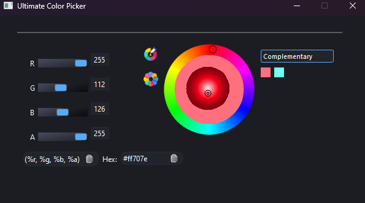

# Ultimate Color Picker

A simple and intuitive color picker tool to help users select and customize colors for their projects. This project is built with C++ and QT and features real-time color updates, customizable palettes, and easy integration. 

## Preview
<picture>
	
</picture>

## Features
- User-friendly color selection interface
- Live preview of selected color
- Save and export color palettes
- Responsive design for all devices
- The ability to specify the format in which the color will be copied
- Keybinds for ease of use (for example to pick colors from outside of this app)
- Supports multiple color models

## Todo
- Contrast checker for flexibility
- The ability to generate CSS code snippets for seamless integration into web projects.
- Customizable UI themes for better user experience

## Installation
Clone the repository:
```bash
  git clone https://github.com/Mez0ry/UltimateColorPicker.git
  mkdir build && cd build && cmake .. --DCMAKE_BUILD_TYPE=Release
```

## Usage
Use the interface to select colors, view previews, and manage your palettes. Customize as needed for your project.

## Contributing
Contributions are welcome! Please fork the repository and create a pull request with your improvements.

## License
This project is licensed under the GPL 3.0 License. See the `LICENSE` file for details.